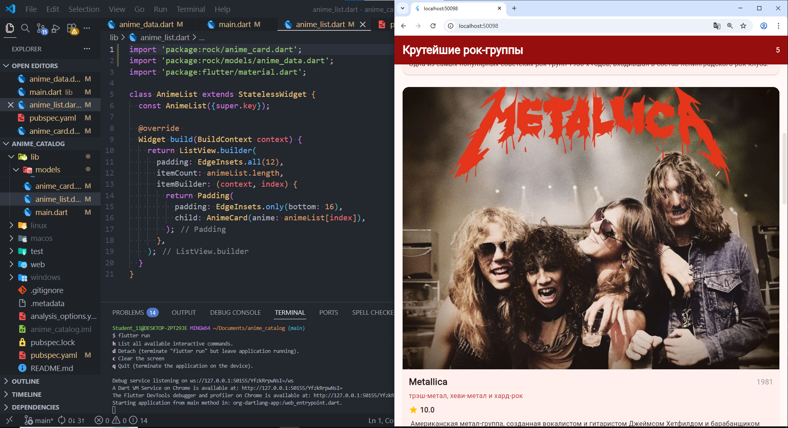

# Лабораторная работа №4. Flutter: списки, модели данных и карточки

## Студент
- **ФИО:** Текутова В.Д.
- **Группа:** ИСП-231
- **Дата сдачи:** 22.04.26

## Что изучили

1. **Модели данных в Dart** - научился создавать классы-модели для хранения структурированных данных (название, описание, время приготовления, путь к изображению). Понял преимущество использования `const` конструкторов для оптимизации.

2. **ListView.builder** - освоил создание эффективных прокручиваемых списков. Понял разницу между `Column` и `ListView.builder`: последний создаёт только видимые элементы, что экономит память и повышает производительность.

3. **Переиспользуемые виджеты** - научился создавать кастомные виджеты-карточки (`RecipeCard`) с собственной структурой и методами. Разбил карточку на логические части: постер, информация, название, время приготовления, описание.

4. **Работа с assets** - научился подключать изображения в Flutter через `pubspec.yaml` и правильно организовывать папку `assets/images/`.

5. **Material Design компоненты** - освоил использование `AppBar`, `Card`, `InkWell`, `Scaffold` и других виджетов для создания современного интерфейса.

## Скриншот приложения



## Инструкция по запуску

### Требования
- Flutter SDK (версия 3.0 или выше)
- VS Code или Android Studio
- Эмулятор/симулятор или физическое устройство

### Установка и запуск

1. **Клонируйте репозиторий:**
   ```bash
    git clone <URL_вашего_репозитория>
    cd Flutter_Lab4
    flutter pub get
    flutter run -d edge
```